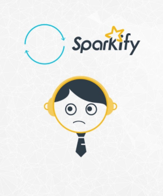

# Sparkify - Udacity DS Nanodegree Capstone Project

## Table of Contents
1. [Installation](#installation)
2. [Project Motivation](#motivation)
3. [File Descriptions](#files)  
4. [Licensing, Authors, and Acknowledgements](#licensing)

### Installation 

This project was carried out locally using the <a href="https://hub.docker.com/r/jupyter/pyspark-notebook">pyspark docker image</a>. Plotly==4.14.3 is the only additional package that was installed on top of the existing libraries that come as part of the docker image.
The code should run without issues using Python 3.*

Before completely this project locally, I initially started on IBM Cloud free tier. However, I soon consumed my monthly quota. But the code should be able to run without issue on IBM cloud.

### Project Motivation 

Imagine a fictitious company Sparkify. A music streaming company similar to the likes of Spotify and Pandora. Millions of users listen to their favorite songs and discover new music on Sparkify. 

Sparkify collects data of all user interactions. The interactions include playing a song, liking a song, disliking a song, adding a friend, etc. This data is a treasure cove to understand user behavior which can help the company improve the product.

Like all subscription based services, the users of the services are either Paid or Free users. Paid users pay a monthly fee whereas Free users are served ads to drive revenue. Such a business model requires the company to do all they can to retain users on the platform. As long as the user continues to use the service, the company makes revenue either from subscription fees or from advertisements. 

So when a user stops using the service altogether, it is said that the user has churned. A service like Sparkify must keep a close eye on a metric that measures this churn and do everything in it's power to keep this metric at a reasonable rate.

In this project, we will try to use the user event logs collected by Sparkify to identify behaviors of users to continue to use the service as opposed to the ones that churned.

#### Part 1: Sparkify_Part_1.ipynb
In Part 1 of this project, we perform analysis of user event log dataset for the fictitious Sparkify service. The outcome of this is a train and test dataset containing engineered features.
    
#### Part 2: Sparkify_Part_2.ipynb
In Part 2, we use the data create from Part 1 to modelling. Using the train and test data, we attempt to use ML algorithms supported by PySpark to model the data and use it to predict users who are likely to churn in the near future.

### File Descriptions 

    \images
        sparkify.png : The logo of the fictitious Sparkify
        udacity=logo.ong : Udacity logo
    LICENSE : The license file
    README.md : The readme file
    Sparkify_Part_1.ipynb : The jupyter notebook with the code for Part 1
    Sparkify_Part_2.ipynb : The jupyter notebook with the code for Part 1
    utility_functions.py : A python module having functions used by both notebooks

### Licensing, Authors, Acknowledgements
This project was done as part of the Udacity Data Scientist Nanodegree. The Sparkify data was provided by Udacity and its partner Insight Data Science.
The licensing information is detailed in the LICENSE file